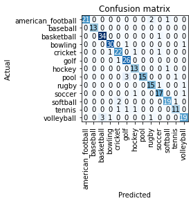

# Ball Image Classifier

* This project follows Ken Jee's Google Colab notebook in creating a Ball Image Classifier
* I was able to get the model to predict the sport of the ball with nearly 90% accuracy after minimal tuning.
* I utilized transfer learning on a Convulational Neural Network trained on resnet34.
* This project utlizes deep learning for image classification and can be useful for someone who is extremely new to sports from a certain country. 
* Ideally, an image can be taken and the app could serve them with historical information and rules of the game that belongs to the respective sport. 
* This project outlines the underlying model for building the applications with the above capabiliteis 

## Notes 
I completed the project following along Ken Jee's informational video, which can be found here: https://www.youtube.com/watch?v=vy-R4oUZaC8&list=PL2zq7klxX5ATPC8RuqCuTDdki3b4NqKQv&index=8

I would recommend utlizing Google Colab's GPU configuration as it makes it far easier.

## Data Collection

Data was used by batch downloading images of the respective sport balls from Google Images
